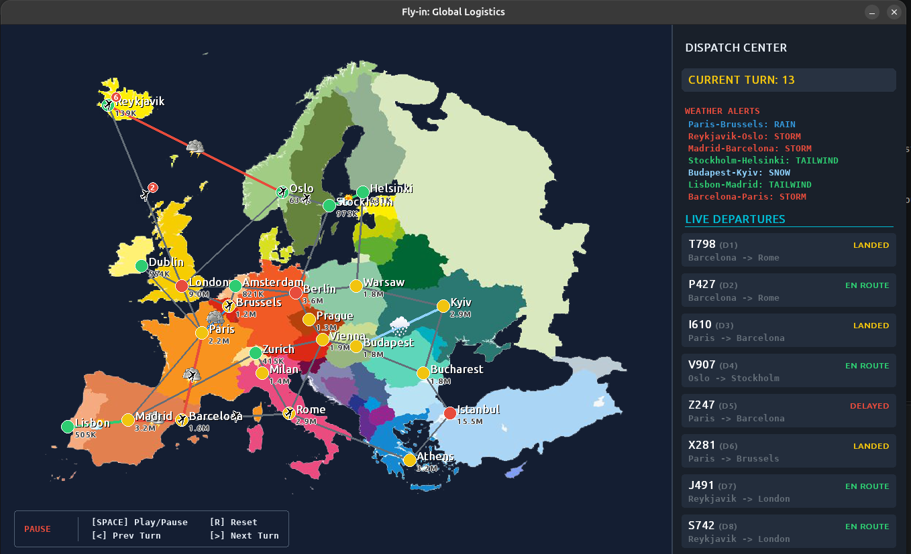
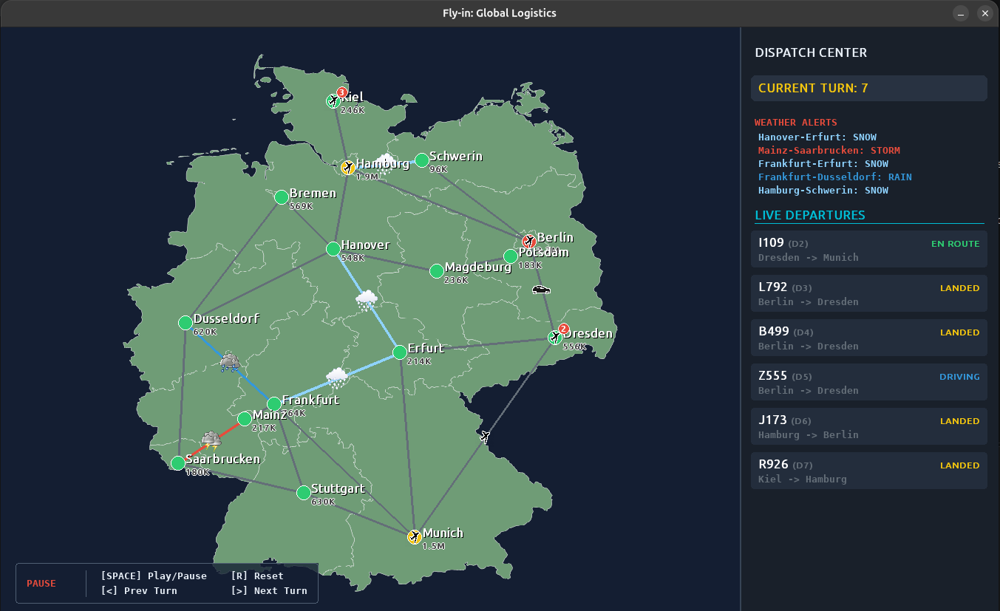

# Maria's Airlanes

_Inspired by the 42 school project "Fly-in"._

Maria's Airlanes is a turn-based air-traffic simulation. A fleet of aircraft
departs from one hub and must reach a destination hub through a network of
air lanes, while every hub and every lane has a limited capacity. The planner
schedules each flight through space and time, so aircraft spread across
alternative routes, hold deliberately when a lane is busy, and never exceed a
capacity limit.

The simulator, parser, routing algorithm, event system, and visualizers are
written from scratch in Python. On top of the routing core, the project adds
an aviation layer: real maps of Germany and Europe, distance-based road and
air legs, live weather, and a Pygame dispatch center.





## Highlights

- **Space-time routing.** Flights are planned over `(hub, turn)` states with
  reservation tables, so conflicts are avoided before they happen rather than
  resolved after a collision.
- **Capacity constraints.** Hubs limit how many aircraft they can hold at
  once; air lanes limit how many aircraft can use them at the same time.
- **Hub types.** `normal`, `priority` (preferred by the planner),
  `restricted` (takes two turns to enter), and `blocked` (never used).
- **Road and air legs.** Each lane is an air or road lane, as declared in the
  map, with its own speed and default lane capacity.
- **Dynamic weather.** In the dispatch center mode, storms, snow, rain, and
  tailwinds appear and clear during the simulation. Storm and snow ground
  aircraft; roads stay open but get slower.
- **Real maps.** Germany (16 hubs) and Europe (24 hubs) with real city names,
  populations, and distances.
- **Aviation dispatch center.** A Pygame interface with a geographic map,
  departure board, weather alerts, and a replayable timeline.
- **Event-driven core.** The simulation emits typed events; every output mode,
  from plain text to Pygame, is a listener on the same event stream.

## Quick start

Requirements: Python 3.14+, [`uv`](https://docs.astral.sh/uv/), and
`pygame-ce` for the graphical modes (installed by `make install`).

```sh
make install
make run MAP=maps/easy/01_linear_path.txt
```

Open the aviation dispatch center on a real map:

```sh
make run-pygame-airlines MAP=maps/bonus/germany_map.txt
make run-pygame-airlines MAP=maps/bonus/europa_map.txt
```

Open the standard turn viewer on any map:

```sh
make run-pygame MAP=maps/hard/03_ultimate_challenge.txt
```

## Output modes

Run the simulator from the repository root with `main.py` or, equivalently,
as the `airlanes` package:

```sh
uv run --locked python3 main.py maps/easy/01_linear_path.txt
uv run --locked python3 -m airlanes maps/easy/01_linear_path.txt
```

Both accept one map file and these options:

| Option | Output |
| --- | --- |
| _(none)_ | Compact text: one line per turn, one `D<n>-<destination>` token per moving aircraft |
| `--visual` | The same text, colored with ANSI codes from the map's hub colors |
| `--airlines` | Readable flight log: departures, legs in progress, arrivals |
| `--capacity-info` | Adds per-turn hub and lane usage, for example `Hamburg=2/18` |
| `--pygame` | Standard Pygame turn viewer for any map |
| `--pygame-airlines` | Aviation dispatch center with dynamic weather |

Example of the compact output:

```txt
D1-waypoint1
D1-waypoint2 D2-waypoint1
D1-goal D2-waypoint2
D2-goal
```

## How routing works

Aircraft are planned one after another with a cooperative, Dijkstra-style
best-first search over `(hub, turn)` states, which also track the consecutive
road distance driven. While a route is being built, the planner reads and
updates shared reservation tables:

- hub occupancy at each turn, including every turn of a leg flying towards
  the hub
- lane usage for every turn a leg is in progress
- departure slots on distance-based lanes, so two aircraft do not take off
  on the same lane in the same direction in the same turn

A candidate move is accepted only if the destination hub has room from the
departure turn to the arrival turn and the lane stays available for the
whole leg. These are the same rules the simulator applies when it runs the
plan, so without weather every flight lands exactly when planned. Holding in
place is a valid move, and the only way to wait: a route never returns to a
hub it has left.

The cost of a move combines its travel time (restricted hubs take two turns,
distance-based legs follow the table below), a discount for priority hubs, and
small penalties for hubs that earlier flights already use or have booked for
the same turn. The penalties spread traffic across parallel routes.

Routes are committed one aircraft at a time, so the result is not a proven
global optimum. In exchange the planner is fast, explainable, and produces
compact schedules on all included maps.

During execution, the simulator runs each turn in phases: aircraft finishing
a leg arrive first, then aircraft at hubs check their routes, departures are
planned from a stable snapshot, and only moves that pass the capacity checks
are applied. A lane goes only to a departure that also fits its destination
hub, so an aircraft that has to wait never blocks one that could leave.

### Rerouting

Each turn, an aircraft waiting at a hub checks how long the rest of its
route takes under the current weather. If that is longer than in clear
weather, it reconsiders the route: it looks for the fastest route under the
current weather, using the same travel times as the table in
[Weather](#weather). A closed lane makes a route infinitely slow.

- If its route is closed, the aircraft takes the route it found. If there is
  none, it waits in the hub, which is always safe, and continues once the
  weather clears.
- If its route is still open but slower, the aircraft switches only to a
  route that is strictly faster now. A tie keeps the current route.

Weather that only makes another route faster, such as a tailwind, is no
reason to reconsider. Once an aircraft reconsiders, though, the tailwind
counts. An aircraft in the middle of a leg always finishes it, at the travel
time fixed when it started. Rerouting ignores other aircraft; the capacity
checks above still apply. So several aircraft can switch to the same route
at once.

### Deadlocks

Because rerouting ignores other aircraft, two aircraft can end up in full
hubs, each needing the other's hub over a lane with room for only one. After
every turn the simulator looks for aircraft that block only each other. One
of them takes a route around the hub it waits for, if there is one. If such a
route would exist once the weather clears, the aircraft wait. Otherwise the
run stops with an error that names the turn, the aircraft, and their hubs,
instead of running on forever.

### Road budget

Roads are a fallback, not the main way to travel: no route may contain more
than 700 km of consecutive road legs. An air leg resets the count. The limit
applies to the initial plan and to every reroute, and a map whose only route
breaks it fails before the first turn.

## Road and air legs

A lane's transport mode comes from the map: `mode=air` (the default) or
`mode=road`. The engine never infers it from distance, coordinates, or city
names. A road lane needs a `distance`. When a lane has a `distance`, travel
time is derived from it and the mode:

| Mode | Speed | Default lane capacity |
| --- | --- | --- |
| road | 100 km/h | 3 |
| air, up to 500 km | 400 km/h | 1 |
| air, over 500 km | 400 km/h | 2 |

Lanes without a `distance` keep the original assignment's rule: entering a
hub takes one turn, or two for a restricted hub. On a lane with a
`distance`, the hub type does not change travel time; whether it should is
an open decision.

The default capacity applies only when the lane does not set
`max_link_capacity` itself. Similarly, a hub with a `population` but no
explicit capacity gets one slot per 100,000 inhabitants.

## Weather

Weather is active in `--pygame-airlines` mode. Each turn, every clear lane has
a 5% chance to change, and every affected lane has a 20% chance to clear again.

| Condition | Air lanes | Road lanes |
| --- | --- | --- |
| `storm`, `snow` | Closed; aircraft hold until the lane reopens | Open, two extra turns |
| `rain` | No effect | One extra turn |
| `tailwind` | Count as half their distance | No effect |

Weather never creates a lane or changes its distance. Every hub is always a
safe place to wait.

Routes are planned before the first turn in clear weather, so the plan is
the same in every run. The first weather is that of turn 1, and every
aircraft sees it before it departs. When the weather makes a route slower or
closes it, the aircraft reconsiders it (see [Rerouting](#rerouting)).
Weather affects whether a leg can start and how long it takes once started.
Weather is random and not seeded, so two runs of the same map can differ.

## Aviation dispatch center

`--pygame-airlines` opens an air-traffic-control style view:

- geographic background for the Germany and Europe maps
- cities sized and colored by population
- airplanes on air legs and cars on road legs, outlined with `pygame.mask` so
  they stay readable on the map
- lanes colored by current weather, with weather icons
- a departure board with a flight number and status for every aircraft
  (`EN ROUTE`, `DRIVING`, `DELAYED`, `ROAD DELAY`, `LANDED`)
- weather alerts in the sidebar
- clicking a city prints a hub report (population, hub type, current load)
  to the terminal

The viewer replays the recorded event stream, so it can step backwards and
forwards through time.

| Key | Action |
| --- | --- |
| `Space` | Play or pause |
| `Right Arrow` | Next turn |
| `Left Arrow` | Previous turn |
| `R` | Reset to turn 0 |

The standard viewer (`--pygame`) uses the same controls.

## Map format

```txt
nb_drones: 4
start_hub: start 0 0 [color=green max_drones=4]
hub: tunnel 1 0 [zone=restricted color=red max_drones=2]
end_hub: goal 2 0 [color=green]
connection: start-tunnel [max_link_capacity=1]
connection: tunnel-goal
```

The keywords `nb_drones` and `max_drones` come from the original project and
are kept for compatibility: `nb_drones` is the number of aircraft, and
`max_drones` is a hub's capacity.

Hub metadata:

- `zone=normal|restricted|priority|blocked`
- `color=<name>`
- `max_drones=<positive integer>`
- `population=<positive integer>`

Lane metadata:

- `max_link_capacity=<positive integer>`
- `distance=<positive integer>km`
- `mode=air|road` (default `air`; `road` requires a `distance`)

The parser reports malformed lines, duplicate hubs and lanes, invalid
capacities and distances, unknown hub types and transport modes, road lanes
without a distance, and missing start or end hubs as a `ParseError`
with the line number. If no route connects the start and end hubs, the
simulator stops with an explicit error, and so it does when aircraft block
each other with no way around (`DeadlockError`).

### Included maps

| Folder | Content |
| --- | --- |
| `maps/easy`, `maps/medium`, `maps/hard` | Abstract graphs from a single lane to dense mazes with tight capacities |
| `maps/challenger` | A 25-aircraft stress test |
| `maps/bonus` | Germany and Europe with real cities, populations, and distances |

## Architecture

The application is one package, `airlanes/`. Root `main.py` and
`python -m airlanes` both start its command line, `airlanes.cli`.

```txt
airlanes/
├── cli.py, __main__.py   command line, python -m airlanes
├── mapfile.py            map files → network
├── model/                hubs, lanes, network, aircraft, transport modes
├── world/                weather and transport rules
├── routing/              initial plan, route search, routing policy
├── simulation/           turn engine, departures, deadlocks
├── events.py             typed events and the dispatcher
├── results.py            results of completed turns
├── output/               text output, Pygame viewers and their images
└── config.py             speeds, weather penalties, cost weights
```

```txt
map file → mapfile.Parser → Graph (hubs, lanes)
                               ↓
                 routing.Pathfinder ← reservation tables
                               ↓
              simulation.Simulator ← WeatherProvider → WeatherState
              (departures, deadlock)
                 ↓                              ↓
     results.TurnResult per turn         EventDispatcher
                 ↓                   ↙       ↓       ↓       ↘
        text (assignment)    flight log  capacity  Pygame  dispatch center
```

| Package or module | Responsibility |
| --- | --- |
| `mapfile` | Reads map files into a `Graph`, reports `ParseError` |
| `model` | Hubs (`zone`), lanes (`connection`), the network (`graph`), aircraft state (`drone`), and transport modes |
| `world` | Weather providers (none, seeded random, scripted), the weather state, and the transport rules: availability and travel time under the weather |
| `routing` | Cooperative space-time planning, reroute search, and route cost (`pathfinder`); routing limits such as the consecutive-road budget (`policy`) |
| `simulation` | Turn execution and route reconsideration (`engine`), departures under lane and hub capacity (`departures`), and deadlock resolution (`deadlock`) |
| `events` | Typed events and the dispatcher |
| `results` | Immutable results of completed turns: departures, arrivals, and reroutes |
| `output` | Text, flight log, and capacity output (`text`); Pygame viewers, their shared helpers, and images (`pygame`) |
| `cli` | Command-line options and the choice of output |
| `config` | Speeds, weather penalties, and cost weights |

Dependencies form an acyclic graph toward lower-level responsibilities:
domain and configuration at the bottom, then world and routing rules,
simulation, output, and finally CLI wiring. The simulator does not know
which visualizer is attached, so it can run headless while the graphical
viewers replay the same events. Each completed turn also yields a
`TurnResult` with what happened in it, and the text output decides how to
show it. The exact allowed dependency directions are recorded in
[ADR-022](docs/engineering/decisions.md#adr-022) and
[ADR-024](docs/engineering/decisions.md#adr-024).

## Development

After cloning, set up the environment and enable the repository hooks once:

```sh
make install       # create .venv and install locked dependencies (uv sync --locked)
make hooks         # git config core.hooksPath .githooks
```

`make hooks` is the only command that changes your local Git configuration.
It activates `.githooks/pre-commit`, which rejects commits made directly on
`main`.

```sh
make test          # run the test suite
make coverage      # run tests with a coverage report
make lint          # flake8 + mypy
make lint-strict   # flake8 + mypy --strict
make check         # lint-strict + test
make clean         # remove caches, coverage data, and the virtual environment
```

Dependencies are declared in `pyproject.toml` and pinned in `uv.lock`. All
`make` targets run with `--locked`, so they never modify `uv.lock`. After
changing dependencies, run `uv lock`, review the diff, and commit both files.

Changes reach `main` only through pull requests, and every pull request is
squash-merged into a single commit.

## Background

The project started as "Fly-in", a 42 school assignment about moving a fleet
through a capacity-limited graph in as few turns as possible. The compact text
output still follows that assignment's format. Maria's Airlanes continues from
there as an independent project focused on aviation-style simulation.

## Resources

- Hart, P. E., Nilsson, N. J., and Raphael, B. (1968).
  "A Formal Basis for the Heuristic Determination of Minimum Cost Paths."
- Silver, D. (2005). "Cooperative Pathfinding."
  <https://ojs.aaai.org/index.php/AIIDE/article/view/18726/18503>
- <https://theory.stanford.edu/~amitp/GameProgramming/AStarComparison.html>
- Gamma, E., Helm, R., Johnson, R., and Vlissides, J. (1994).
  _Design Patterns: Elements of Reusable Object-Oriented Software._
- Python documentation
- Pygame documentation

### AI usage

AI tools were used as learning support during development: to discuss design
alternatives, improve wording, review type-checking issues. The graph model,
parser rules, scheduling logic, cooperative pathfinding approach, simulation
architecture, and project-specific bonus features were designed and implemented
by me.

## License

MIT, © 2026 Mariia Lagutina. See [LICENSE](LICENSE).
